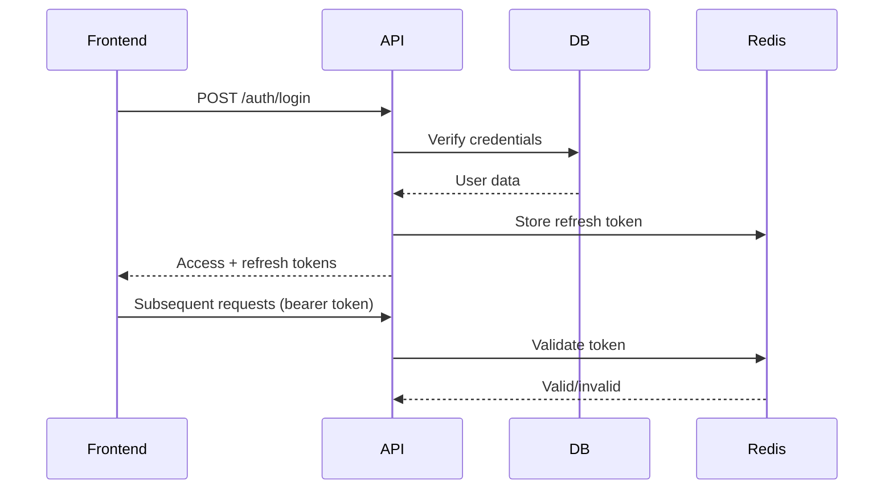

# Architecture

## Overview

Vercelplay is a video platform built with React frontend and Bun/Elysia backend. It handles video upload, transcoding, streaming, billing, and admin management.

## System Architecture

### Frontend Stack
- React 19 + Vite + TypeScript
- Tailwind CSS v4Enhance the existing architecture documentation.

Add ONLY these sections:

1. Request Lifecycle
- how a request flows from frontend → API → DB → response

2. Failure Handling
- what happens if:
  - upload fails
  - FFmpeg fails
  - queue job fails
- include retry logic

3. Scalability Design
- how system scales:
  - horizontal workers
  - storage scaling
  - queue scaling

STRICT MODE:
- do not rewrite previous content
- only append new sections
- keep concise

docs/ARCHITECTURE.md
# Architecture

## Overview
## System Architecture
## Video Flow (HLS)
## Database DesignEnhance the existing architecture documentation.

Add ONLY these sections:

1. Request Lifecycle
- how a request flows from frontend → API → DB → response

2. Failure Handling
- what happens if:
  - upload fails
  - FFmpeg fails
  - queue job fails
- include retry logic

3. Scalability Design
- how system scales:
  - horizontal workers
  - storage scaling
  - queue scaling

STRICT MODE:
- do not rewrite previous content
- only append new sections
- keep concise

docs/ARCHITECTURE.md
# Architecture

## Overview
## System Architecture
## Video Flow (HLS)
## Database Design
## Request Lifecycle
## Failure Handling
## ScalabilityEnhance the existing architecture documentation.

Add ONLY these sections:

1. Request Lifecycle
- how a request flows from frontend → API → DB → response

2. Failure Handling
- what happens if:
  - upload fails
  - FFmpeg fails
  - queue job fails
- include retry logic

3. Scalability Design
- how system scales:
  - horizontal workers
  - storage scaling
  - queue scaling

STRICT MODE:
- do not rewrite previous content
- only append new sections
- keep concise

docs/ARCHITECTURE.md
# Architecture

## Overview
## System Architecture
## Video Flow (HLS)
## Database Design
## Request Lifecycle
## Failure Handling
## Scalability
## Request Lifecycle
## Failure Handling
## Scalability
- HLS.js for video streaming
- JWT authentication flow

### Backend Stack
- Bun runtime with Elysia framework
- PostgreSQL + Drizzle ORM
- Redis for caching and BullMQ queue
- S3/R2 storage with abstraction layer
- Background worker for video processing

## Video Flow (HLS)

Video upload follows this flow:
1. Frontend → API upload endpoint
2. API stores metadata in DB
3. BullMQ job created for processing
4. Worker picks up job, processes with FFmpeg
5. HLS segments uploaded to storage
6. DB updated with final URLs
7. Frontend displays streaming player

## Database Design

### Main Tables
- `users` - User accounts and roles
- `videos` - Video metadata and status
- `plans` - Subscription plans
- `billing_subscriptions` - User subscriptions
- `folders` - Video organization
- `video_folders` - Junction table for video-folder relationships
- `storage_providers` - Storage configuration
- `audit_logs` - Activity tracking

### Key Relationships
- Users own videos and subscriptions
- Videos belong to users
- Videos can be organized in folders (many-to-many)
- Subscriptions link users to plans

## Request Lifecycle

### Standard Request Flow

1. **Frontend Request**
   ```javascript
   // React component makes API call
   fetch('/api/videos', {
     headers: { Authorization: `Bearer ${token}` }
   })
   ```

2. **API Processing**
   - Route handler receives request
   - Authentication guard validates JWT
   - Rate limiting check (burst/sustained)
   - Business logic execution

3. **Database Interaction**
   ```typescript
   // Drizzle ORM query
   const videos = await db
     .select()
     .from(videos)
     .where(eq(videos.userId, userId))
   ```

4. **Response Formatting**
   - Success: `{ success: true, data: {...} }`
   - Error: `{ success: false, error: {...} }`
   - Response sent with appropriate status code

5. **Frontend Update**
   - React state updated with response
   - UI re-rendered if needed
   - Loading states cleared

### Auth Flow Special Case


## Failure Handling

### Upload Failure Handling

**Scenario**: User uploads corrupt video file

1. **Initial Validation**
   ```typescript
   // API checks file
   if (!isValidVideoType(file)) {
     return error('INVALID_VIDEO_TYPE');
   }
   ```

2. **Database Rollback**
   ```typescript
   // If upload fails, delete DB record
   await db.delete(videos).where(eq(videos.id, videoId));
   ```

3. **Queue Cleanup**
   ```typescript
   // Remove pending job
   await queue.removeJobs('video-processing', { videoId });
   ```

4. **User Notification**
   ```typescript
   // Frontend shows error
   toast.error('Upload failed. Please try again.');
   ```

### FFmpeg Processing Failure

**Scenario**: Video cannot be transcoded

1. **Worker Error Handling**
   ```typescript
   try {
     await ffmpeg.exec(command);
   } catch (error) {
     await db.update(videos)
       .set({ status: 'error' })
       .where(eq(videos.id, videoId));
     throw error;
   }
   ```

2. **Retry Mechanism**
   ```typescript
   // Job definition with retry
   queue.add('video-processing', { videoId }, {
     attempts: 3,
     backoff: {
       type: 'exponential',
       delay: 5000,
     }
   });
   ```

3. **Dead Letter Queue**
   - Jobs failing all retries moved to DLQ
   - Admin dashboard can retry manually
   - Error details logged for debugging

### Queue Job Failure

**Scenario**: Worker crashes during processing

1. **Automatic Recovery**
   - BullMQ tracks job status in Redis
   - Failed jobs remain in queue
   - Worker restart reclaims jobs

2. **Heartbeat Monitoring**
   ```typescript
   // Worker sends heartbeat
   setInterval(() => {
     redis.set('worker:heartbeat', Date.now());
   }, 5000);
   ```

3. **Admin Intervention**
   - Studio dashboard shows failed jobs
   - Manual retry option for failed jobs
   - Job history with error details

## Scalability Design

### Horizontal Worker Scaling

**Current Setup**
```bash
# Single worker
bun run dev:worker
```

**Scaled Setup**
```bash
# Multiple workers
bun run dev:worker -- 1
bun run dev:worker -- 2
bun run dev:worker -- 3
```

**Worker Distribution**
- BullMQ automatically distributes jobs
- Workers maintain independent Redis connections
- Heartbeats track active workers

**Worker Configuration**
```typescript
// Environment-based scaling
const WORKER_COUNT = process.env.WORKER_COUNT || 1;
const WORKER_ID = process.env.WORKER_ID || 0;

// Each worker processes subset of jobs
const worker = new Worker('video-processing', async (job) => {
  // Process based on worker ID
});
```

### Storage Scaling

**Current Architecture**
```typescript
// Single storage provider
const storage = new S3Storage(config);
```

**Scaled Options**

**Option 1: Multi-region S3**
```typescript
// Regional storage
const usEastStorage = new S3Storage(usEastConfig);
const euWestStorage = new S3Storage(euWestConfig);

// Route based on user location
const storage = userRegion === 'EU' ? euWestStorage : usEastStorage;
```

**Option 2: CDN Layer**
```typescript
// CloudFront distribution
const cdn = new CloudFront({
  distribution: 'CDN_DISTRIBUTION_ID',
  origin: 'S3_BUCKET_NAME'
});
```

**Option 3: Local + Cloud Hybrid**
```typescript
// Priority-based storage
const storage = new TieredStorage([
  { storage: localStorage, priority: 1 },
  { storage: s3Storage, priority: 2 }
]);
```

### Queue Scaling

**Current Setup**
```typescript
// Single BullMQ instance
const queue = new BullMQQueue();
```

**Scaled Strategies**

**Option 1: Queue Partitioning**
```typescript
// Separate queues by video size
const smallVideoQueue = new Queue('small-videos');
const largeVideoQueue = new Queue('large-videos');

// Route based on file size
if (fileSize < 100MB) {
  smallVideoQueue.add(job);
} else {
  largeVideoQueue.add(job);
}
```

**Option 2: Distributed Queues**
```typescript
// Redis Cluster support
const queue = new BullMQQueue({
  connection: {
    host: ['redis-node-1', 'redis-node-2'],
    maxRetriesPerRequest: 3
  }
});
```

**Option 3: Priority Queues**
```typescript
// Multiple priority levels
const highPriorityQueue = new Queue('high-priority', {
  priority: 10
});
const normalPriorityQueue = new Queue('normal-priority', {
  priority: 5
});
```

### Caching Strategy

**Redis Patterns**
```typescript
// Cache frequently accessed data
await redis.set(`video:${videoId}`, JSON.stringify(video), {
  EX: 3600 // 1 hour
});

// Cache user's videos list
await redis.set(`user:${userId}:videos`, JSON.stringify(videos), {
  EX: 1800 // 30 minutes
});
```

**Cache Invalidation**
```typescript
// Clear cache on updates
await redis.del(`video:${videoId}`);
await redis.del(`user:${userId}:videos`);
```